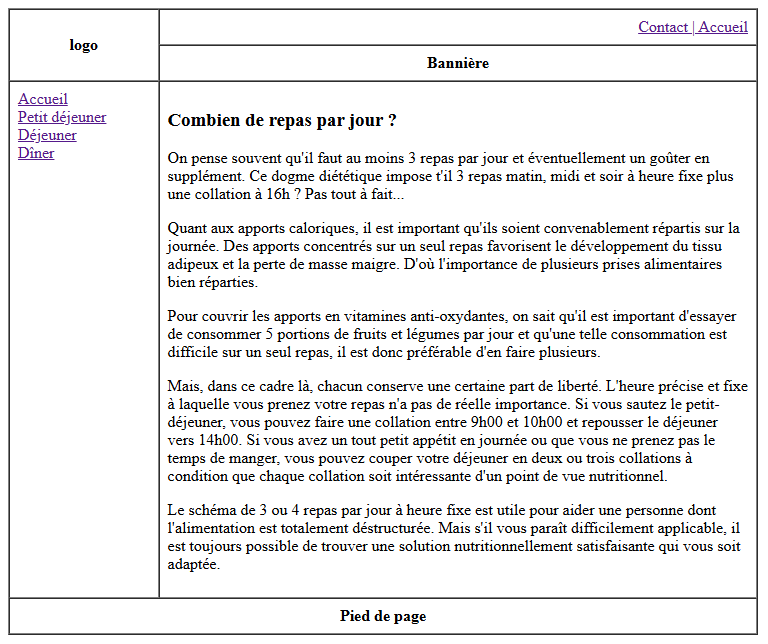
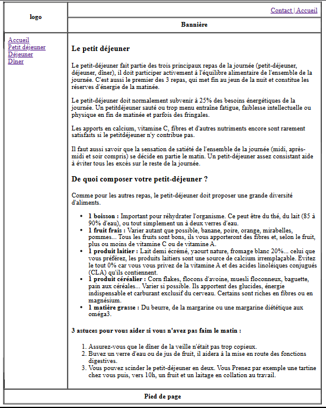
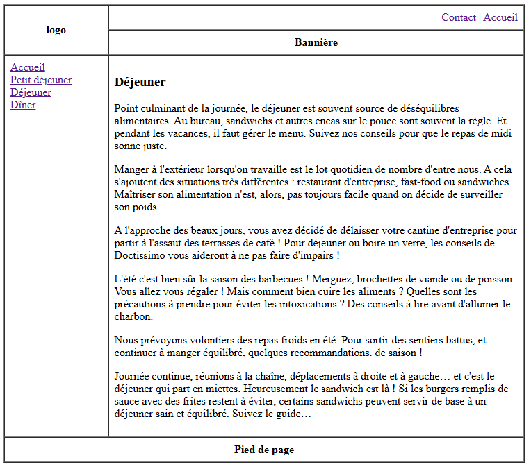
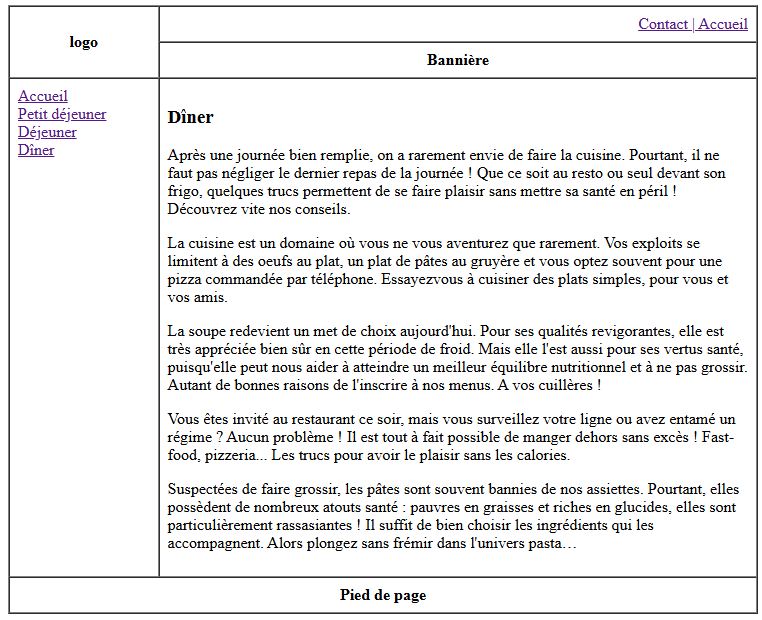

# HTML Restaurant Website Lab

This project demonstrates a basic HTML website about daily meals and nutrition using table-based layouts. The website consists of multiple pages that provide information about different meals throughout the day.

## Project Structure

- [index.html](index.html) - Home page explaining the importance of meal frequency
- [Petit-dejeuner.html](Petit-dejeuner.html) - Breakfast page with nutrition tips
- [Dejeuner.html](Dejeuner.html) - Lunch page with dining advice
- [Diner.html](Diner.html) - Dinner page with evening meal guidance
- [gabari.html](gabari.html) - Template file showing the base layout structure

## Screenshots

### Home Page

*Main page showing meal frequency information*

### Breakfast Page

*Breakfast recommendations and nutrition tips*

### Lunch Page

*Lunch options and workplace dining advice*

### Dinner Page

*Evening meal suggestions and recipes*

## Layout Features

Each page follows a consistent table-based layout with:
- Header section with logo and navigation
- Left sidebar with meal links
- Main content area
- Footer section

## Page Contents

1. **Home Page**
   - Discusses optimal number of daily meals
   - Explains importance of caloric distribution
   - Provides flexibility in meal timing

2. **Breakfast Page**
   - Details about breakfast importance
   - Recommended breakfast components
   - Tips for those who struggle with morning appetite

3. **Lunch Page**
   - Guidelines for workplace lunches
   - Tips for outdoor dining
   - Information about healthy sandwich options

4. **Dinner Page**
   - Evening meal recommendations
   - Simple cooking suggestions
   - Information about pasta and soup options

## Technical Implementation

- Pure HTML implementation without CSS
- Table-based responsive layout (750px width)
- Semantic HTML elements (headings, paragraphs, lists)
- Internal navigation with relative links

## Learning Objectives

This lab demonstrates:
- Basic HTML structure and elements
- Table-based layouts
- Internal page linking
- Content organization
- Semantic HTML usage