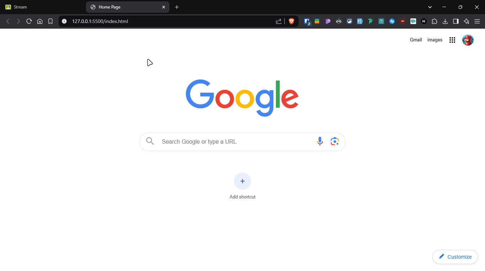

# Google Homepage Clone

This project is a pixel-perfect clone of the Google Search homepage, created using HTML and CSS. It demonstrates modern web development practices and responsive design principles.

## Features

- Faithful recreation of Google's search homepage UI
- Responsive design that adapts to different screen sizes
- Interactive elements with hover effects
- Custom styling for navigation, search bar, and shortcuts
- Clean and well-structured code

## Technologies Used

- HTML5
- CSS3
- SVG icons
- Responsive Grid Layout
- Flexbox

## Project Structure

```
├── img/
│   ├── google-logo.png
│   └── profile.jpeg
├── screenshot/
│   └── home-page.png
├── index.html
├── style.css
└── README.md
```

## Key Components

1. **Navigation Bar**
    - Gmail and Images links
    - Google Apps menu
    - Profile picture

2. **Search Section**
    - Google logo
    - Search input with icons
    - Voice search and Google Lens buttons

3. **Shortcuts Area**
    - Add shortcut button
    - Grid layout for bookmarks

4. **Customize Button**
    - Fixed position in bottom-right
    - Hover effects
    - Custom SVG icon

## Screenshot



## CSS Features

- CSS Grid for page layout
- Flexbox for component alignment
- Custom hover effects
- Responsive design
- Shadow effects
- SVG icon integration

## Setup

1. Clone this repository
2. Open `index.html` in your browser
3. No build process required - pure HTML and CSS

## Learning Outcomes

- Advanced CSS layout techniques
- SVG integration
- Responsive design principles
- UI component recreation
- CSS Grid and Flexbox mastery