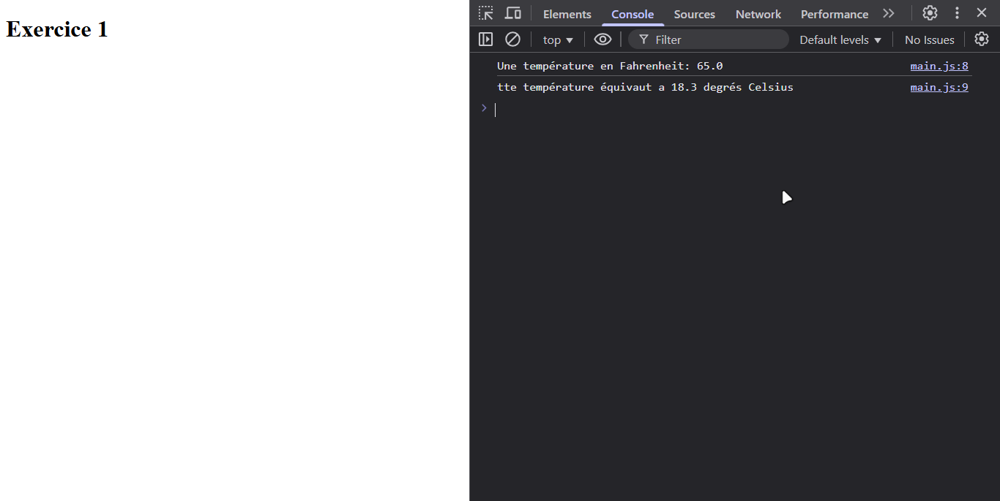
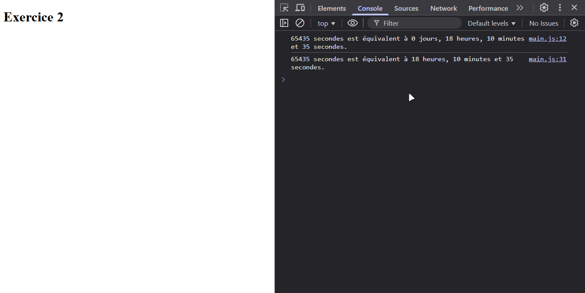
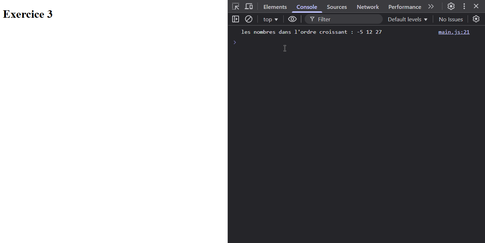
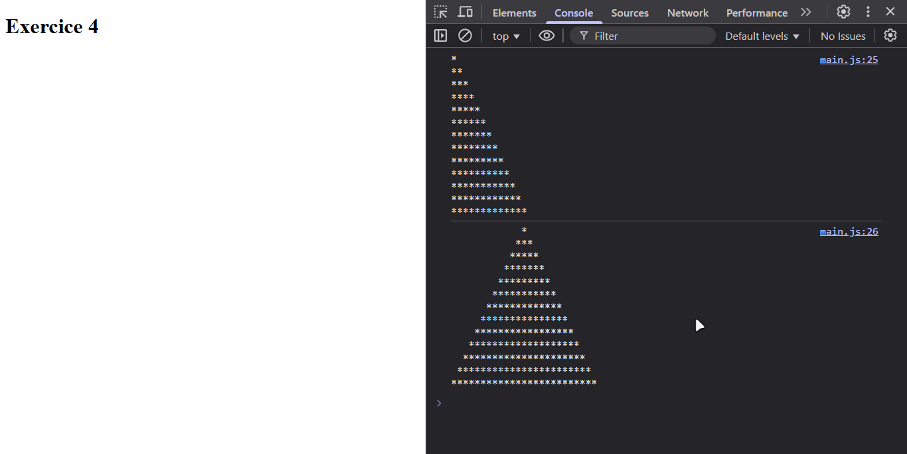
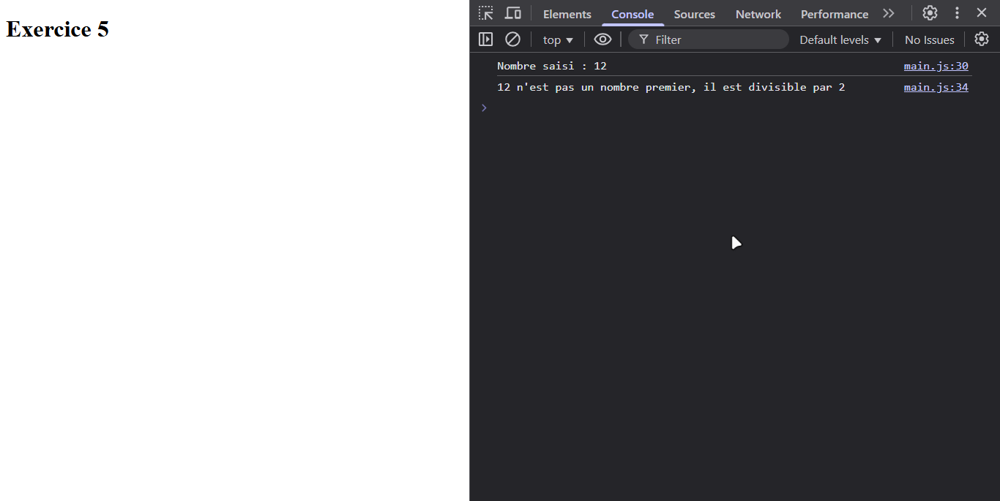
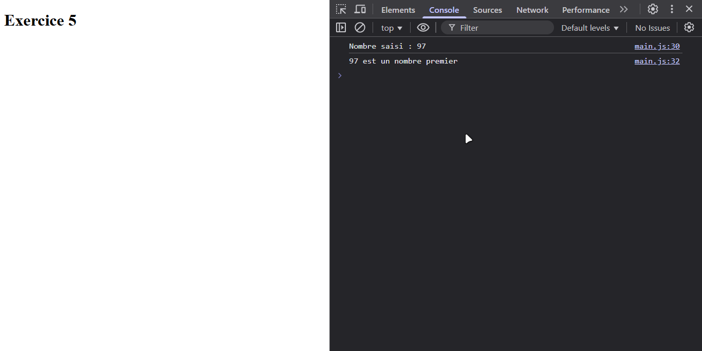
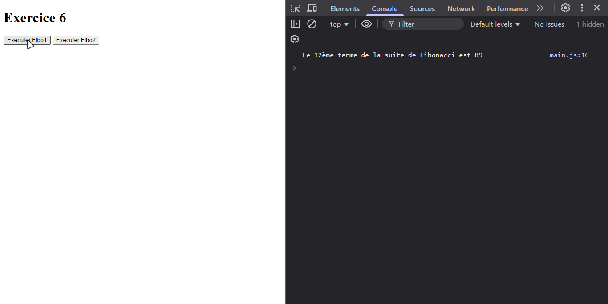
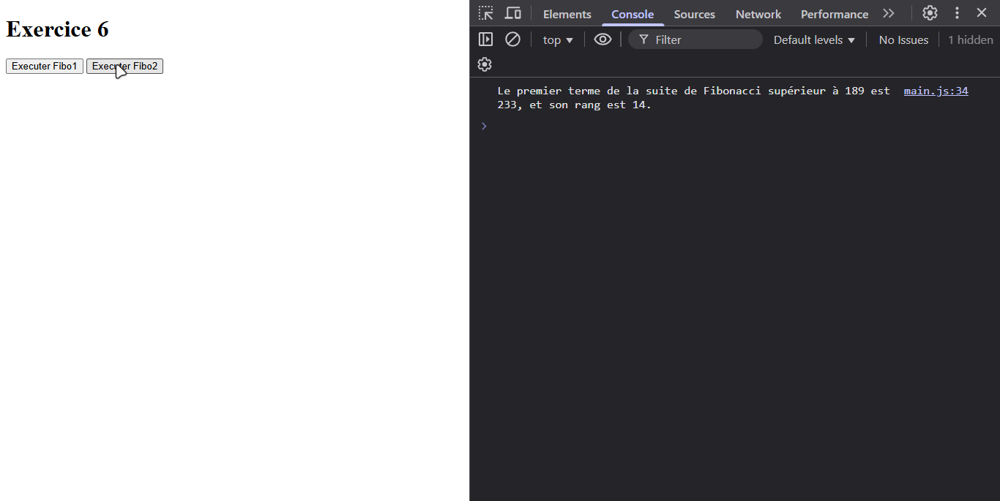
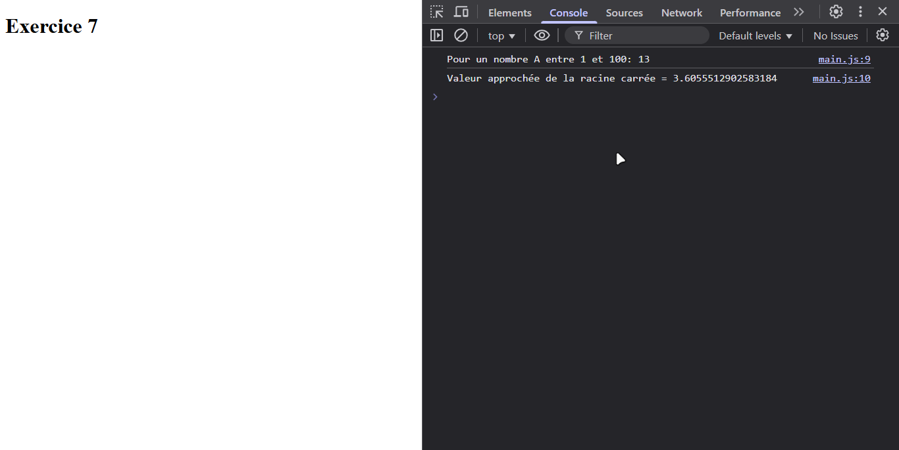
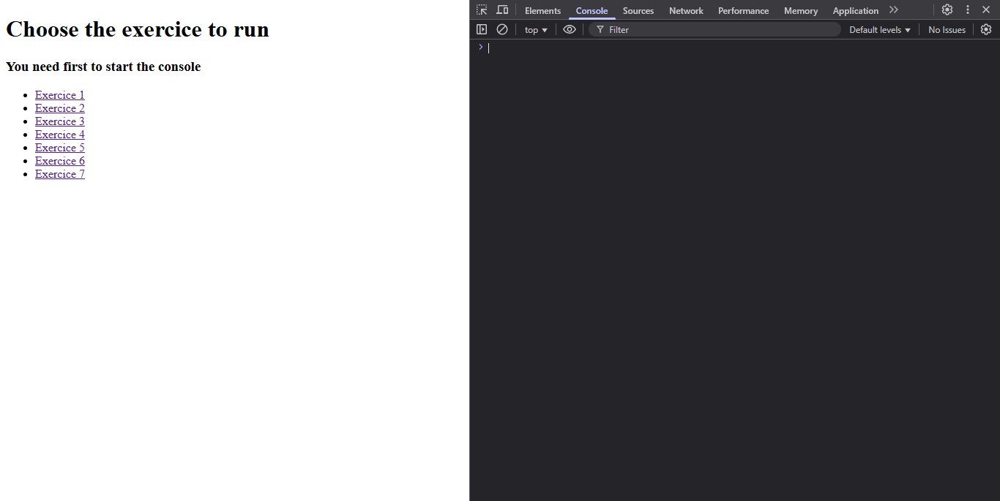

# JavaScript Introduction Exercises

A collection of 7 JavaScript exercises demonstrating fundamental programming concepts.

## Exercises Overview

### Temperature Converter (Exercice1)

- Converts Fahrenheit to Celsius
- Uses prompt for user input

### Time Converter (Exercice2)

- Converts seconds to days, hours, minutes, and seconds
- Includes improved display formatting

### Number Sorter (Exercice3)

- Takes three numbers as input
- Returns them in ascending order

### Pattern Generator (Exercice4)

- Creates stair and pyramid patterns
- Uses asterisks (*) for visualization

### Prime Number Checker (Exercice5)

- Verifies if a number is prime
- Provides the smallest divisor if not prime

### Fibonacci Calculator (Exercice6)

- Two implementations:
    - Finds nth Fibonacci number
    - Finds first Fibonacci number greater than input

### Square Root Calculator (Exercice7)

- Implements numerical method for square root calculation
- Works for numbers between 1 and 100

## How to Run

1. Open `index.html` in a web browser.

2. Open the browser's developer console (F12).
3. Click on any exercise link to run it.
4. Follow the prompts to input values.