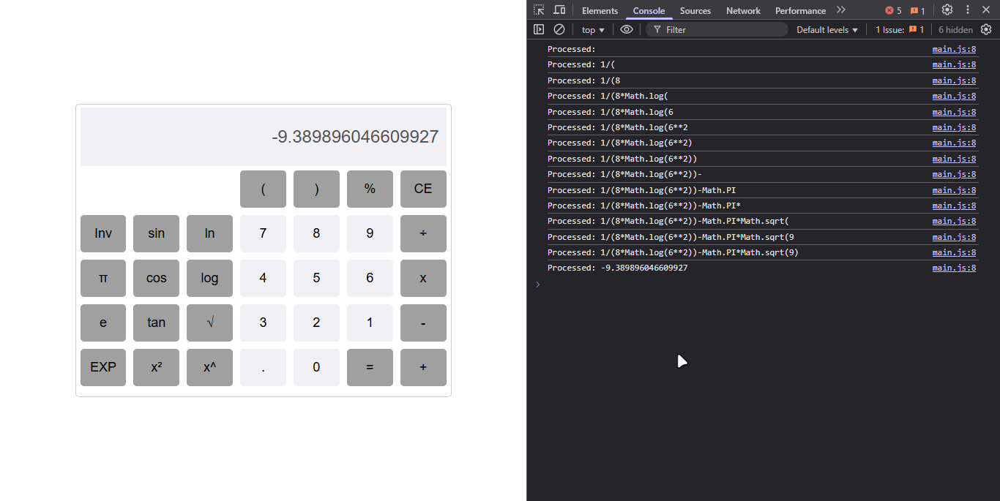

# JavaScript Event Handling Lab

This Lab contains a collection of small web applications demonstrating JavaScript event handling and DOM manipulation. Each project explores different aspects of user interaction and JavaScript functionality.

## Table of Contents

1. [Calculatrice Simple (Simple Calculator)](#calculatrice-simple)
2. [Calculatrice Avancée (Advanced Calculator)](#calculatrice-avancée)
3. [Calcul IMC (BMI Calculator)](#calcul-imc)
4. [Permutation](#permutation)

## Calculatrice Simple

A basic calculator that performs simple arithmetic operations on two numbers.

### Features
- Addition, subtraction, multiplication, and division operations
- Simple interface with two input fields and result display

### Implementation
The calculator uses plain JavaScript to handle the four basic mathematical operations. Each operation has a corresponding function that retrieves values from input fields, performs the calculation, and displays the result.

```javascript
function add() {
  result.value = parseInt(number1.value) + parseInt(number2.value);
}
```

### Screenshot


## Calculatrice Avancée

A scientific calculator with advanced mathematical functions like trigonometry, logarithms, and more.

### Features
- Basic arithmetic operations
- Trigonometric functions (sin, cos, tan)
- Logarithmic functions (ln, log)
- Constants (π, e)
- Parentheses for complex expressions
- Square, square root, and exponentiation

### Implementation
This calculator maintains two expressions:
- `displayedExpression`: What the user sees in the calculator display
- `processedExpression`: The JavaScript-compatible calculation string that will be evaluated

The calculator uses mapping objects to convert displayed math symbols to JavaScript syntax:

```javascript
const funcMap = {
  sin: "Math.sin(",
  cos: "Math.cos(",
  // Other functions...
};
```

Expression validation ensures users can't input invalid mathematical expressions:

```javascript
function canAppend(token) {
  // Logic to check if token can be appended
}
```

### Screenshot




## Calcul IMC

A Body Mass Index (BMI) calculator that determines your BMI category based on height and weight.

### Features
- Calculates BMI from height and weight inputs
- Provides classification of BMI result (underweight, normal, overweight, etc.)
- Simple and intuitive interface

### Implementation
The calculator uses a simple formula to calculate BMI and then determines the corresponding category:

```javascript
function imcCalculator() {
  let imcResult = +weight.value / (+height.value * +height.value);
  // Determine BMI category and display result
}
```

### Screenshot


## Permutation

A simple application demonstrating value swapping between two input fields.

### Features
- Swaps the values of two input fields with a button click

### Implementation
This app uses JavaScript destructuring assignment to efficiently swap values:

```javascript
function permutation() {
    let inputs = document.getElementsByTagName('input');
    [inputs[0].value, inputs[1].value] = [inputs[1].value, inputs[0].value];
}
```

### Screenshot


## Running the Applications

1. Clone this repository
2. Open any of the project folders
3. Open the `index.html` file in your web browser
4. Interact with the application

## Technologies Used

- HTML5
- CSS3
- JavaScript (ES6+)
- DOM Manipulation