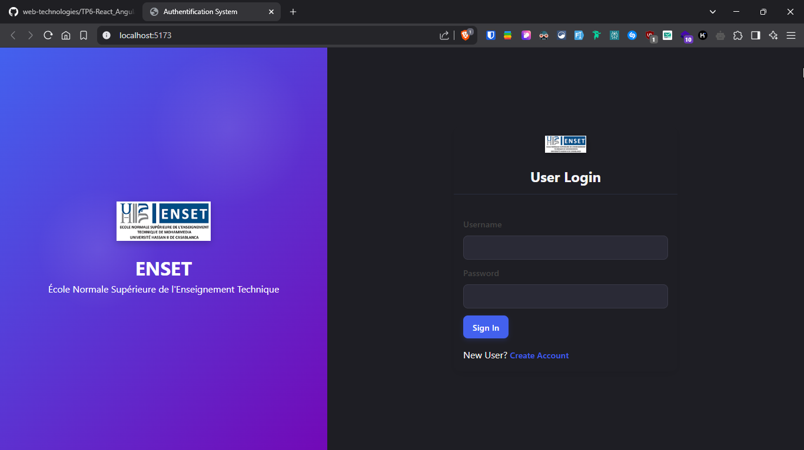
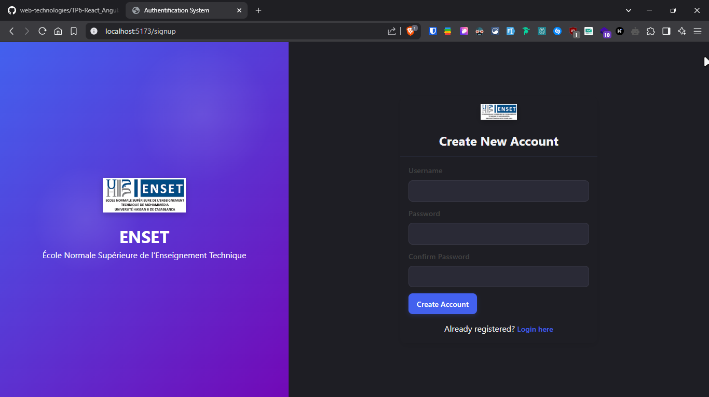
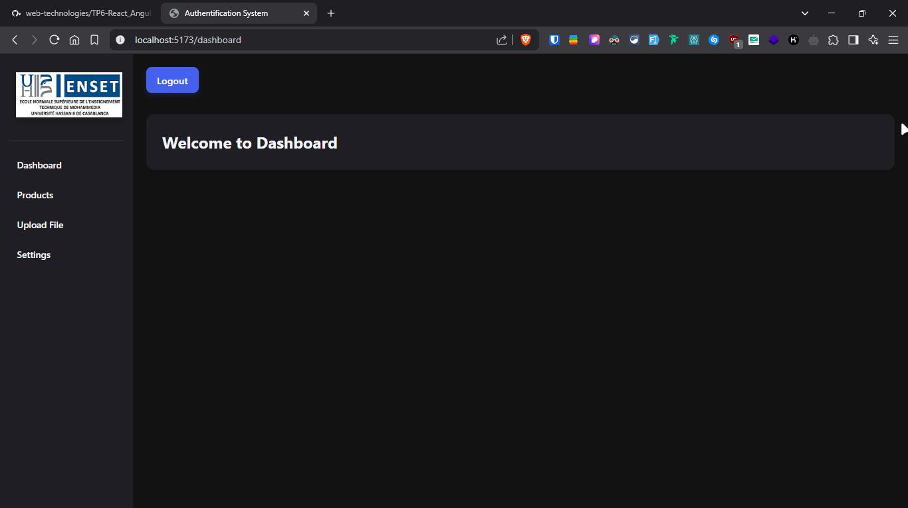

# Authentication Systems Lab - Web Technologies

This repository contains two implementations of authentication systems developed as part of the Web Technologies laboratory at École Normale Supérieure de l'Enseignement Technique (ENSET) ElMohammadia. The purpose of this lab is to demonstrate authentication workflows in both React and Angular frameworks.

## Overview

This project consists of two separate applications:

1. [React Authentication System](./react-auth-system/) - A complete authentication system built with React 19, utilizing modern React features and hooks.

2. [Angular Authentication System](./angular-auth-system/) - A parallel implementation using Angular 19, demonstrating Angular's approach to the same authentication concepts.

Both applications implement similar features with framework-specific approaches, allowing for comparison between React and Angular methodologies.

## Lab Purpose

This laboratory work aims to:

- Compare implementation approaches between React and Angular
- Demonstrate best practices for authentication in modern web applications
- Provide hands-on experience with form handling, validation, and secure authentication
- Showcase responsive UI design principles
- Practice routing and protected routes in both frameworks

## Application Features

Both implementations include:

- User registration with validation
- Secure login with password hashing (SHA-256)
- Protected dashboard for authenticated users
- Responsive design for various screen sizes
- Form validation with error handling
- Token-based authentication using localStorage

## Screenshots

### Login Interface


### Registration Interface


### Dashboard Interface


## User Registration

The system allows users to register securely. Sample registered user:

```json
{
    "users": [
        {
            "id": "ddc3",
            "username": "Otmane",
            "password": "f2e2b060bcf30081c4afa04118dd60271d5515b92516096a263b43f410703f0d"
        }
    ]
}
```

Notice that passwords are securely stored using SHA-256 hashing.

## Technical Implementation

For detailed information about each implementation:

- [React Authentication System Documentation](./react-auth-system/README.md)
- [Angular Authentication System Documentation](./angular-auth-system/README.md)

## Getting Started

Each application has its own setup instructions in their respective README files. Both applications use JSON Server as a mock backend API.

## Security Considerations

These implementations demonstrate educational concepts and should not be used directly in production without additional security measures like:

- Proper token-based authentication with JWTs
- Server-side validation
- HTTPS enforcement
- CSRF protection
- Rate limiting
